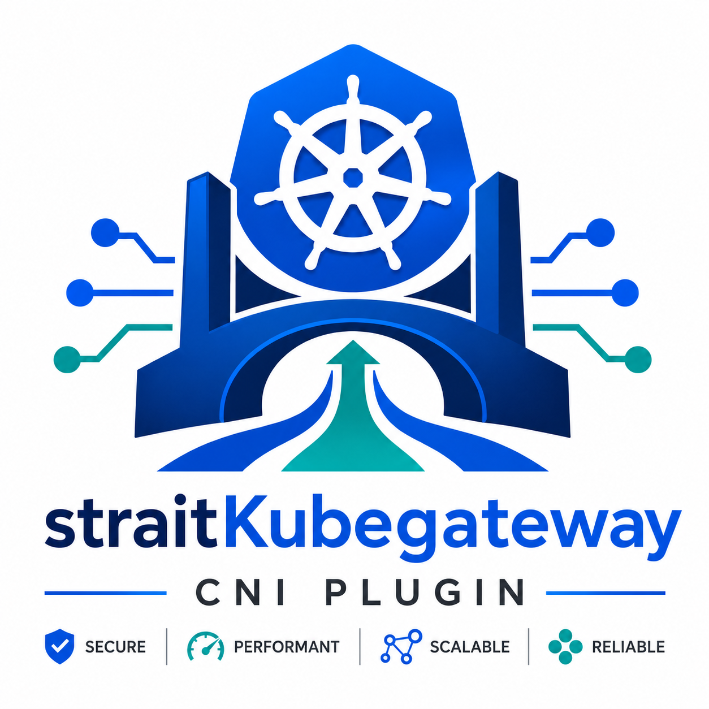

<p align="center">
  
</p>

<h1 align="center">StraitKubeGateway</h1>

<p align="center">
  <strong>Kubernetes-Native eBPF Transit Gateway, CNI Plugin & Service Mesh</strong>
</p>

<p align="center">
  <em>Secure · Performant · Scalable · Reliable</em>
</p>

<p align="center">
  <a href="https://github.com/msaeedb40/straitKubegateway/actions"></a>
  
  
  
  
</p>

---

## Overview

**StraitKubeGateway** is a high-performance, Kubernetes-native transit gateway and eBPF networking platform that combines:

- 🔧 **Production-grade CNI** with Linux NetKit device attachment
- ⚡ **eBPF-powered data plane** using XDP, TCX, NetKit, and cgroup hooks
- ⚖️ **Kernel-native service load balancing** (full kube-proxy replacement via Maglev consistent hashing)
- 🛡️ **Stateful firewall** with identity-based `StraitNetworkPolicy` enforcement
- 🌐 **Multi-cluster transit networking** across isolated segments (32-bit segment IDs)
- 🚪 **Gateway API v1.6.1** conformance (HTTP, TCP, UDP, gRPC, TLS routes)
- 📡 **BGP-4 dynamic routing** with sub-second BFD failure detection
- 🔒 **WireGuard & IPsec encryption** for pod-to-pod and node-to-node traffic

Designed for public clouds, bare-metal, edge, hybrid-cloud, multi-cloud, and air-gapped Kubernetes environments with **zero cloud-provider lock-in**.

---

## Architecture

```
                      Kubernetes API
                            │
             ┌──────────────┼───────────────┐
             ▼              ▼               ▼
          Service         Policy         Transit
             │              │               │
             └──────────────┼───────────────┘
                            ▼
                    Network State (IR)
                            │
                            ▼
                   Dataplane Compiler
                            │
              ┌─────────────┼─────────────┐
              ▼             ▼             ▼
            NetKit         TCX           XDP
                            │
                        BPF Maps
```

> **Architectural Invariant**: Controllers produce desired network state. The Dataplane Compiler is the **sole writer** that translates IR into BPF maps and netlink state. No controller touches eBPF maps directly.

---

## Quick Start

### Install via Helm

```bash
helm repo add straitkubegateway https://charts.straitkubegateway.io
helm repo update

helm install straitkubegateway straitkubegateway/straitkubegateway \
  --namespace kube-system \
  --create-namespace
```

### Install via sg-cli

```bash
sg-cli install --namespace kube-system
```

### Verify

```bash
kubectl get pods -n kube-system -l app.kubernetes.io/name=straitkubegateway
sg-cli status
```

---

## Key Features

| Feature | Technology |
|---|---|
| Pod Networking | Linux NetKit + TCX (eBPF) |
| Ingress Fast Path | XDP at NIC driver level |
| Kube-Proxy Replacement | Maglev 127-slot consistent hash (eBPF `tc` + `cgroup/connect4`) |
| Network Policy | Stateful identity-based firewall (LRU conntrack + priority rules 0-255) |
| Gateway API | v1.6.1 GatewayClass, Gateway, HTTPRoute, TCPRoute, UDPRoute, GRPCRoute, TLSRoute |
| Multi-Cluster Transit | 32-bit segments, hub-spoke / mesh / peer-to-peer |
| Dynamic Routing | BGP-4 + BFD (RFC 5880) sub-second failover |
| Encryption | WireGuard (Curve25519 / X25519) + IPsec ESP (AES-GCM) |
| IPAM | Dynamic CIDR discovery, dual-stack IPv4/IPv6, broadcast exclusion |
| Observability | Prometheus metrics, structured logging (zap), OpenTelemetry traces |

---

## Components

| Component | Binary | Deployment | Description |
|---|---|---|---|
| **sg-controller** | `cmd/sg-controller` | Deployment (2 replicas, leader-elected) | Reconciles K8s resources into network state IR |
| **straitd** | `cmd/straitd` | DaemonSet (every node) | Compiles IR → BPF maps, manages CNI lifecycle |
| **CNI Plugin** | `cni/plugin.go` | Binary on each node | Handles container ADD/DEL/CHECK/GC |
| **sg-cli** | `cmd/sg-cli` | Client binary | CLI management and troubleshooting tool |

---

## Documentation

| Document | Description |
|---|---|
| [Overview](docs/overview.md) | Platform summary and feature pillars |
| [Architecture](docs/architecture.md) | System components and Mermaid diagrams |
| [Workflow](docs/workflow.md) | Traffic lifecycle with color-coded flow diagrams |
| [Capabilities](docs/capability.md) | Comprehensive feature matrix |
| [Security](docs/security.md) | RBAC, capabilities, encryption, and policy engine |
| [Observability](docs/observability.md) | Metrics, logging, tracing, and flow events |
| [Operator Guide](docs/guide.md) | Install, setup, upgrade, uninstall, and testing |
| [CLI Reference](docs/cli.md) | `sg-cli` command reference |

---

## Build

### Prerequisites

- Go 1.26.7+
- Clang 22+ / LLVM 22+ (for eBPF C programs)
- Linux kernel headers 6.7+

### Build Binaries

```bash
# Build all Go binaries
go build -o bin/sg-controller ./cmd/sg-controller
go build -o bin/straitd ./cmd/straitd
go build -o bin/sg-cli ./cmd/sg-cli
go build -o bin/straitkubegateway-cni ./cni

# Build eBPF programs
make -C bpf/
```

### Run Tests

```bash
go test -v -race ./...
go vet ./...
helm lint straitKubegateway-helm-repo
```

---

## Project Structure

```
straitKubegateway/
├── api/v1alpha1/         # CRD type definitions
├── bpf/
│   ├── headers/          # eBPF helper headers
│   └── src/              # eBPF C programs (XDP, TC, cgroup)
├── cmd/
│   ├── sg-controller/    # Control plane manager
│   ├── straitd/          # Node agent daemon
│   └── sg-cli/           # CLI management tool
├── cni/                  # CNI plugin (ADD/DEL/CHECK/GC)
├── controllers/          # Kubernetes reconcilers
├── dataplane/            # Top-level dataplane orchestrator
├── docs/                 # Documentation
├── encryption/           # WireGuard & IPsec managers
├── gateway/              # Gateway API v1.6.1 manager
├── identity/             # BPF security identity allocator
├── internal/
│   └── dataplane/
│       ├── compiler/     # Sole BPF map writer
│       └── ir/           # Intermediate Representation types
├── ipam/                 # Dynamic CIDR discovery & IP allocation
├── logo/                 # Project logo
├── nat/                  # SNAT/DNAT/Masquerade/NAT64
├── observability/        # Canonical metadata & telemetry
├── pkg/                  # Reusable libraries (bpf, identity, net, types)
├── platform/             # Linux platform (cgroup v2, systemd, netns)
├── policy/               # Network policy engine & compiler
├── routing/              # BGP-4 & BFD engines
├── service/              # Service & EndpointSlice compiler
├── straitKubegateway-helm-repo/  # Helm chart
├── transit/              # Multi-cluster transit gateway
└── ui/                   # Angular 22 dashboard
```

---

## License

Copyright 2026 straitKubegateway authors. Licensed under the [Apache License, Version 2.0](LICENSE).