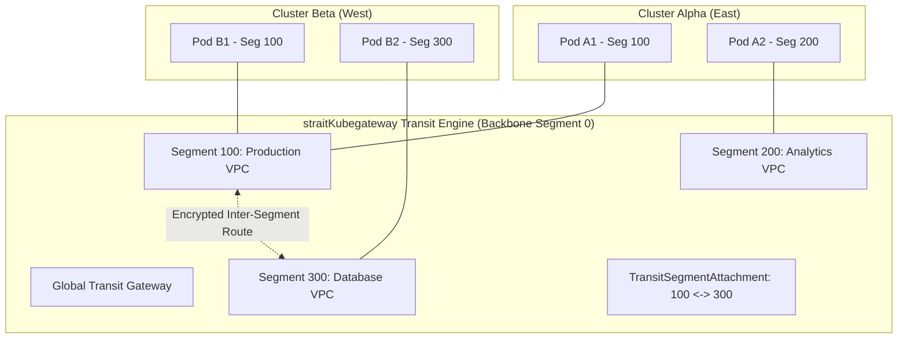

<div align="center">


# straitKubegateway

**Next-Generation eBPF CNI, Gateway API Controller, and Multi-Cluster Transit Gateway for Kubernetes**

[](https://golang.org)
[](https://kernel.org)
[](#ebpf-dataplane-features)
[](https://kubernetes.io)
[](#gateway-api-features)
[](LICENSE)

</div>

---

## 📖 Overview

**straitKubegateway** is a unified, high-performance cloud-native networking platform that integrates:
- A **production-grade eBPF Container Network Interface (CNI)** using modern Linux 6.7+ `NetKit` device drivers.
- A **high-performance kube-proxy replacement** with socket-level load balancing, Maglev consistent hashing, and Direct Server Return (DSR).
- A complete **Kubernetes Gateway API (v1.1+) implementation** supporting HTTPRoute, GRPCRoute, TCPRoute, UDPRoute, and TLSRoute.
- An enterprise **Multi-Cluster Transit Gateway** with 32-bit network segmentation, automated route propagation, and WireGuard/IPsec encryption.
- An advanced **Security & Policy Engine (`StraitNetworkPolicy`)** with 3-tier hierarchical authority (`Cluster` > `Segment` > `Namespace`) and fine-grained L3–L7 selectors.
- A **BGP Routing & Peering subsystem** with BFD (Bidirectional Forwarding Detection) for rapid failover and hybrid-cloud integration.
- An **Observability & Analytics stack** accompanied by an **Angular 22 real-time UI dashboard** and an operational CLI (`sg-cli`).

---

## 📑 Table of Contents

- [Key Features](#-key-features)
- [Architecture](#-architecture)
- [Component Overview](#-component-overview)
- [eBPF Dataplane & Performance](#-ebpf-dataplane--performance)
- [Multi-Cluster Transit Gateway & Segmentation](#-multi-cluster-transit-gateway--segmentation)
- [StraitNetworkPolicy Hierarchy](#-straitnetworkpolicy-hierarchy)
- [Quick Start & Installation](#-quick-start--installation)
- [CLI Reference (`sg-cli`)](#-cli-reference-sg-cli)
- [CRD Overview](#-crd-overview)
- [Documentation Index](#-documentation-index)
- [Building & Development](#-building--development)
- [Contributing & License](#-contributing--license)

---

## ⚡ Key Features

| Capability | Feature Details |
| :--- | :--- |
| **Modern eBPF CNI** | Replaces legacy `veth` pairs with Linux 6.7+ `NetKit` devices, bypassing intermediate network stack layers for ultra-low latency. |
| **kube-proxy Replacement** | In-kernel eBPF service routing, DNAT/SNAT, DSR (Direct Server Return), Session Affinity, and Maglev consistent hashing. |
| **Gateway API v1.1+** | Native support for HTTPRoute, GRPCRoute, TCPRoute, UDPRoute, header mutation, path rewrites, regex matching, and weighted traffic splits. |
| **Multi-Cluster Transit Hub** | Hub-and-Spoke, Full Mesh, and Peer-to-Peer topologies with multi-cluster route propagation and cluster federation links. |
| **32-Bit Segmentation** | VRF-style micro-segmentation (Segment `0` backbone to `4294967295`) with strict default isolation and explicit segment peering attachments. |
| **Hierarchical Security** | Priority-based `StraitNetworkPolicy` enforcing Cluster > Segment > Namespace policies with deny-precedence rules. |
| **Transit Encryption** | Transparent wire-speed pod-to-pod and cluster-to-cluster encryption via in-kernel WireGuard and IPsec (AES-GCM-256) with key rotation. |
| **BGP & BFD Peering** | Integrated BGP speaker advertising Pod CIDRs, Service VIPs, and Transit Routes to Top-of-Rack (ToR) switches with sub-second BFD failover. |
| **Real-time Observability** | eBPF socket tracing, flow logging, Prometheus metrics, and an integrated Angular 22 dashboard. |

---

## 🏗 Architecture

```
                    ┌────────────────────────────────────────────────────────┐
                    │               Kubernetes Control Plane                │
                    │   - API Server (Gateway API, CRDs, Endpoints)          │
                    └───────────────────────────┬────────────────────────────┘
                                                │
                                                ▼
┌──────────────────────────────────────────────────────────────────────────────────────────────┐
│  sg-controller (Control Plane Leader)                                                         │
│  ├─ Gateway Controller      ├─ NetworkPolicy Controller    ├─ Transit & Segment Controller   │
│  ├─ Service / EPSync        ├─ IPAM Allocator Reconciler   ├─ BGP Peering & Speaker Engine   │
│  └─ Cluster Federation Sync ├─ Identity Allocator          └─ Observability / Metrics        │
└───────────────────────────────────────────────┬──────────────────────────────────────────────┘
                                                │ gRPC / CRD State
                                                ▼
┌──────────────────────────────────────────────────────────────────────────────────────────────┐
│  straitd (Per-Node DaemonSet Agent)                                                          │
│  ├─ CNI Plugin Manager (`straitkubegateway-cni`)    ├─ eBPF Program & Map Loader             │
│  ├─ NetKit Link & Interface Provisioner             ├─ TCX / XDP Datapath Controller         │
│  ├─ Sockops Socket Accelerator                      ├─ WireGuard / IPsec Tunnel Engine       │
│  └─ cgroup v2 Containment Manager                   └─ Local BPF Map Synchronizer            │
└───────────────────────────────────────────────┬──────────────────────────────────────────────┘
                                                │
                                                ▼
┌──────────────────────────────────────────────────────────────────────────────────────────────┐
│  Linux Kernel Dataplane (Linux 6.7+ / 6.12 LTS Recommended)                                  │
│  ┌───────────────────────┐  ┌───────────────────────┐  ┌───────────────────────────────────┐ │
│  │   NetKit Fastpath     │  │   TCX Ingress/Egress  │  │  XDP High-Performance Pre-stack   │ │
│  │ (Container Netns Link)│  │ (Policy & Conntrack)  │  │   (DDoS & Inbound Packet Filter)  │ │
│  └───────────────────────┘  └───────────────────────┘  └───────────────────────────────────┘ │
│  ┌───────────────────────┐  ┌───────────────────────┐  ┌───────────────────────────────────┐ │
│  │  Sockops Acceleration │  │   Cgroup v2 Connect   │  │        BPF Maps Key Storage       │ │
│  │  (Pod-to-Pod Bypass)  │  │ (kube-proxy Replacement) (Endpoints, Services, Conntrack,   │ │
│  └───────────────────────┘  └───────────────────────┘  │  Policies, SNAT, Nat64, Segments) │ │
│                                                        └───────────────────────────────────┘ │
└──────────────────────────────────────────────────────────────────────────────────────────────┘
```

---

## 📦 Component Overview

| Component | Binary / Package | Description |
| :--- | :--- | :--- |
| **Control Plane** | `sg-controller` | Active-passive HA controller managing Gateway API resources, StraitNetworkPolicy compilation, Transit routes, IPAM pools, BGP peer state, and cluster links. |
| **Node Daemon** | `straitd` | Runs on each node. Interacts with the kernel to attach eBPF programs (NetKit, TCX, XDP, Sockops), maintain BPF maps, configure WireGuard, and enforce local policies. |
| **CNI Plugin** | `straitkubegateway-cni` | Standard CNI binary invoked by kubelet/containerd during container creation and deletion to set up NetKit interfaces and allocate IPs. |
| **CLI Tool** | `sg-cli` | Administrative, diagnostic, and troubleshooting command-line utility for dumping BPF maps, simulating policies, and inspecting transit state. |
| **UI Dashboard** | `ui` | Web-based Angular 22 visualization portal showing real-time network topologies, active endpoints, live packet flow telemetry, and segment isolation status. |
| **Helm Chart** | `straitKubegateway-helm` | Complete production Helm package supporting automated deployment of CRDs, daemonsets, controllers, RBAC, and UI components. |

---

## 🚀 eBPF Dataplane Features

1. **NetKit Network Devices**:
   - Replaces traditional `veth` interfaces with Linux 6.7+ `NetKit` (`bpf_netkit`), achieving direct packet transfer between host and container network namespaces with zero skb cloning.
2. **eBPF kube-proxy Replacement**:
   - Intercepts `connect()`, `sendmsg()`, and `recvmsg()` system calls at the socket layer (`sockops` and cgroup v2 hooks).
   - Translates Service VIPs into pod IPs directly at socket establishment time, removing packet-level per-packet NAT overhead.
3. **Consistent Hashing & DSR**:
   - Maglev lookup tables distribute incoming traffic evenly across healthy backend pods.
   - Direct Server Return (DSR) allows response packets to travel directly from backend pods to clients without traversing the gateway node.
4. **Hardware-Accelerated XDP**:
   - Executes packet filtering, anti-DDoS mitigation, and fast ingress routing at the network interface driver level before memory allocation.

---

## 🌐 Multi-Cluster Transit Gateway & Segmentation

straitKubegateway provides enterprise WAN and multi-cluster routing capabilities:



- **Isolated Segments**: By default, endpoints in different Segment IDs cannot communicate.
- **Inter-Segment Peering**: Use `TransitSegmentAttachment` and `TransitSegmentRoute` to allow selective, audited traffic routing between VPCs/segments.
- **Transparent WireGuard / IPsec Mesh**: Tunnels are automatically established between cluster endpoints with in-kernel encryption and automatic key rotation.

---

## 🔒 StraitNetworkPolicy Hierarchy

straitKubegateway evaluates policies with strict hierarchical precedence:

$$\text{Cluster Policies (Rank 1)} \succ \text{Segment Policies (Rank 2)} \succ \text{Namespace Policies (Rank 3)}$$

Within each tier, rules are evaluated by **Priority** (lower number = higher priority) and sequential **RuleNo** (1-based index; RuleNo `0` is discarded). Deny actions take precedence over allow actions when matched at the same priority level.

---

## 🛠 Quick Start & Installation

### Prerequisites
- **Linux Kernel**: 6.7+ (Recommended: Linux 6.12 LTS+)
- **Kubernetes**: v1.30+
- **Helm**: v3.12+ or v4.x
- **Kernel Config**: `CONFIG_BPF=y`, `CONFIG_BPF_SYSCALL=y`, `CONFIG_NETKIT=y`, `CONFIG_CGROUP_BPF=y`

### 1. Install via Helm
```bash
# Add or clone the repository
git clone https://github.com/straitKubegateway/straitKubegateway.git
cd straitKubegateway

# Deploy straitKubegateway
helm upgrade --install straitkubegateway ./straitKubegateway-helm \
  --namespace strait-system \
  --create-namespace \
  --set agent.kubeProxyReplacement=true \
  --set transit.enabled=true
```

### 2. Verify Operational Status
```bash
# Check status using sg-cli
sg-cli status
```

Output:
```
straitKubegateway Status:
  CNI:           Ready (NetKit eBPF)
  Control Plane: Running (sg-controller)
  Node Agent:    Active (straitd)
  Dataplane:     Linux Kernel 6.7+ eBPF (NetKit + TCX + XDP)
  Kube-Proxy:    Replacement Active (eBPF Service LB)
  BGP Speaker:   Running
  Transit Hub:   Segment 0 Backbone Connected
```

### 3. Open the UI Dashboard
```bash
sg-cli ui
# Access dashboard at http://localhost:4200
```

---

## 💻 CLI Reference (`sg-cli`)

`sg-cli` provides unified diagnostics and operations:

```bash
# Inspect overall health
sg-cli status

# Inspect active node agents and BPF maps
sg-cli node list
sg-cli node bpf-maps

# List and inspect active pod network endpoints
sg-cli endpoint list
sg-cli endpoint get <container-id>

# Manage Gateway API instances
sg-cli gateway list
sg-cli gateway get <gateway-name>

# Simulate and evaluate network policies
sg-cli policy list
sg-cli policy simulate

# Inspect multi-cluster transit and segments
sg-cli transit gateways
sg-cli transit segments

# Inspect BGP sessions and advertised routes
sg-cli bgp peers
sg-cli bgp routes

# Check WireGuard & IPsec encryption status
sg-cli wireguard status
sg-cli ipsec status
```

For complete details, see [CLI Reference](docs/cli-reference.md).

---

## 📑 CRD Overview

| Resource Kind | API Group | Scope | Description |
| :--- | :--- | :--- | :--- |
| `Gateway` | `straitkubegateway.io/v1alpha1` | Namespaced | Gateway API listener definition with segment binding and TLS config. |
| `StraitNetworkPolicy` | `straitkubegateway.io/v1alpha1` | Namespaced / Cluster | Enhanced network policy supporting Cluster/Segment/Namespace scope and L3–L7 selectors. |
| `TransitGateway` | `straitkubegateway.io/v1alpha1` | Cluster | Multi-cluster transit gateway topology (hub-spoke, mesh, peer-to-peer). |
| `TransitAttachment` | `straitkubegateway.io/v1alpha1` | Cluster | Attaches a Kubernetes cluster to a TransitGateway with advertised CIDRs. |
| `Segment` | `straitkubegateway.io/v1alpha1` | Cluster | Defines a 32-bit isolated network segment with backbone connectivity settings. |
| `TransitSegmentAttachment` | `straitkubegateway.io/v1alpha1` | Cluster | Bridges two segments together for inter-segment communication. |
| `TransitSegmentRoute` | `straitkubegateway.io/v1alpha1` | Cluster | Static routing rule propagating CIDR ranges across segment attachments. |
| `BGPPeer` | `straitkubegateway.io/v1alpha1` | Cluster | External BGP session peering configuration with BFD and route filters. |
| `IPAMPool` | `straitkubegateway.io/v1alpha1` | Cluster | IP address pool defining pod CIDRs, mask sizes, and node allocations. |
| `ClusterLink` | `straitkubegateway.io/v1alpha1` | Cluster | Federation link connecting remote Kubernetes clusters. |

For detailed field specifications and manifests, see [CRD Reference](docs/crd-reference.md).

---

## 📚 Documentation Index

- 🏛 **[Architecture Deep-Dive](docs/architecture.md)** — Control plane, node agent, NetKit CNI datapath, packet flow diagrams, and kernel invariants.
- 🚀 **[Getting Started Guide](docs/getting-started.md)** — Step-by-step tutorial for deploying straitKubegateway, configuring routes, and policies.
- 💻 **[CLI Reference](docs/cli-reference.md)** — Comprehensive command syntax, flags, subcommands, and sample outputs.
- 📋 **[CRD Reference](docs/crd-reference.md)** — Full specification, field tables, and YAML examples for all Custom Resources.

---

## 🔨 Building & Development

### Requirements
- Go 1.26.5+
- Clang / LLVM 18+ (for eBPF compilation)
- Node.js 20+ and Angular CLI (for UI)
- Docker / Podman (for container image generation)

### Build Targets
```bash
# Build all Go binaries and BPF bytecode
make build

# Build specific components
make build-straitd         # Build node agent
make build-sg-controller   # Build control plane
make build-sg-cli          # Build CLI binary
make build-cni             # Build CNI plugin
make build-bpf             # Compile eBPF C programs to .o

# Run test suites
make test                  # Run unit tests
make test-integration      # Run integration tests
make test-e2e              # Run end-to-end tests
make test-dataplane        # Run dataplane tests
make test-ui               # Run Angular tests

# Code generation & verification
make generate              # Generate deepcopy, CRD manifests, BPF bindings
make lint                  # Run golangci-lint
make verify                # Run formatting and artifact verification
```

---

## 📄 Contributing & License

Contributions are welcome! Please check our repository guidelines and make sure all tests pass (`make test lint verify`) before submitting a pull request.

straitKubegateway is open source software licensed under the [Apache License 2.0](LICENSE).