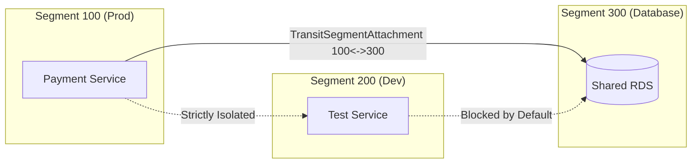

# straitKubegateway Architecture

**straitKubegateway** is a unified, high-performance cloud-native networking platform that integrates an eBPF Container Network Interface (CNI), an in-kernel `kube-proxy` replacement, a Kubernetes Gateway API v1.1+ controller, and an enterprise multi-cluster Transit Gateway with 32-bit VRF-style segmentation.

---

## 1. System Architecture Overview

```
                                  ┌────────────────────────────────────────┐
                                  │      Kubernetes API Server (K8s)       │
                                  │   Gateway API, CRDs, Endpoints, Pods   │
                                  └───────────────────┬────────────────────┘
                                                      │
                                                      ▼
┌────────────────────────────────────────────────────────────────────────────────────────────────────────┐
│  Control Plane: sg-controller (HA Active/Passive Leader Election)                                      │
│  ├─ Gateway Controller             ├─ StraitNetworkPolicy Controller      ├─ Transit Gateway Controller│
│  ├─ Service & EndpointSlice Sync   ├─ IPAM Pool Reconciler                ├─ BGP Speaker & Peer Engine │
│  ├─ Identity Allocator Reconciler  ├─ Cluster Federation Controller       └─ Prometheus Metrics (:9090)│
└─────────────────────────────────────────────────────┬──────────────────────────────────────────────────┘
                                                      │ gRPC / CRD State
                                                      ▼
┌────────────────────────────────────────────────────────────────────────────────────────────────────────┐
│  Node Runtime: straitd (DaemonSet on every Kubernetes Node)                                            │
│  ├─ CNI Plugin Provider (`straitkubegateway-cni`)    ├─ eBPF Program & Map Lifecycle Manager           │
│  ├─ NetKit Link Manager (host <-> container)        ├─ TCX / XDP Attach & Detach Controller           │
│  ├─ Sockops Socket Accelerator                      ├─ WireGuard / IPsec Dynamic Tunnel Engine        │
│  └─ cgroup v2 Resource Containment                  └─ Local BPF Map Synchronizer                     │
└─────────────────────────────────────────────────────┬──────────────────────────────────────────────────┘
                                                      │
                                                      ▼
┌────────────────────────────────────────────────────────────────────────────────────────────────────────┐
│  eBPF Dataplane (Linux Kernel 6.7+ / 6.12 LTS Recommended)                                             │
│                                                                                                        │
│  ┌───────────────────────┐      ┌────────────────────────┐      ┌───────────────────────────────────┐  │
│  │   NetKit Fastpath     │      │   TCX Ingress/Egress   │      │   XDP Driver / Native Path        │  │
│  │ (Zero-copy Netns Link)│      │  (Policy & Conntrack)  │      │  (Anti-DDoS, L4 Ingress Filter)   │  │
│  └───────────────────────┘      └────────────────────────┘      └───────────────────────────────────┘  │
│                                                                                                        │
│  ┌───────────────────────┐      ┌────────────────────────┐      ┌───────────────────────────────────┐  │
│  │  Sockops Acceleration │      │   Cgroup v2 Connect    │      │        eBPF Map Subsystems        │  │
│  │  (Pod-to-Pod Bypass)  │      │ (Socket-Level Service) │      │  - endpoints_map (65k entries)    │  │
│  └───────────────────────┘      └────────────────────────┘      │  - services_map  (16k entries)    │  │
│                                                                 │  - policies_map  (65k entries)    │  │
│  ┌───────────────────────┐      ┌────────────────────────┐      │  - conntrack_map (128k entries)   │  │
│  │   Maglev Hash Table   │      │   WireGuard / IPsec    │      │  - snat_map      (65k entries)    │  │
│  │   (Consistent DSR LB) │      │ (Kernel Tunnel Engine) │      │  - segment_routes_map (32k)       │  │
│  └───────────────────────┘      └────────────────────────┘      └───────────────────────────────────┘  │
└────────────────────────────────────────────────────────────────────────────────────────────────────────┘
```

---

## 2. Core Subsystems & Components

### 2.1 Control Plane (`sg-controller`)
`sg-controller` runs as a highly available Kubernetes Deployment with active-passive leader election (`leaseDuration: 15s`, `renewDeadline: 10s`, `retryPeriod: 2s`).

- **Gateway Controller**: Reconciles `Gateway`, `HTTPRoute`, `GRPCRoute`, `TCPRoute`, and `UDPRoute` resources. Compiles path prefixes, regex matches, header transforms, weighted backends, and binds listeners to network segments.
- **StraitNetworkPolicy Controller**: Translates high-level multi-cluster, segment, and namespace security policies into flat, compiled BPF rules (`CompiledRule`), sorting them by scope hierarchy, numerical priority, and rule index.
- **Transit Controller**: Manages multi-cluster topologies (Hub-Spoke, Full Mesh, Peer-to-Peer), segment attachments, and inter-segment routing tables.
- **Service & Endpoint Controller**: Replaces kube-proxy by syncing Services and EndpointSlices directly to node eBPF map caches.
- **BGP Controller**: Binds to port 179 and maintains external BGP peering sessions with Top-of-Rack (ToR) switches and cloud routers, announcing pod CIDRs and Gateway VIPs with sub-second Bidirectional Forwarding Detection (BFD).
- **Cluster Federation Controller**: Establishes secure control links with remote Kubernetes clusters using `ClusterLink` CRDs.
- **IPAM Controller**: Allocates disjoint Pod CIDR blocks from `IPAMPool` resources to each cluster node.

---

### 2.2 Node Agent (`straitd`)
`straitd` runs as a privileged DaemonSet on every worker node and controls the host networking datapath.

- **Process Supervision**: Managed by a built-in fault-tolerant supervisor with clean signal handling (`SIGTERM`/`SIGINT`).
- **Kernel Environment Detection**: Probes host kernel capabilities (Linux 6.7+ detection, `bpf_netkit` support, `tcx` hooks, `cgroup v2` tree).
- **BPFFS Management**: Automatically mounts and manages the BPF filesystem at `/sys/fs/bpf`.
- **Cgroup v2 Containment**: Manages socket hooks under `/sys/fs/cgroup` to intercept connection setup.
- **Dataplane Manager**: Coordinates IP allocation, interface creation, security identity assignment, and eBPF map programming for each pod.

---

### 2.3 CNI Plugin (`straitkubegateway-cni`)
The CNI plugin binary implements standard CNI v1.0.0+ specifications. When kubelet schedules a pod:
1. `straitkubegateway-cni` is invoked with `ADD` action.
2. It makes a local IPC call to `straitd`.
3. `straitd` allocates an IP from `ipam.Allocator`, creates a `NetKit` pair (`sg-xxxx` host side, `eth0` container side), assigns a numerical Security Identity, and populates `endpoints_map`.
4. Returns container IP, gateway IP, MTU, and interface indices to kubelet.

---

## 3. Linux 6.7+ eBPF Dataplane Innovations

### 3.1 NetKit vs Traditional Veth
Traditional Kubernetes CNIs rely on Linux `veth` pairs, which force packets through two full kernel network stack traversals, netfilter conntrack passes, and sk_buff copies.

straitKubegateway utilizes Linux 6.7+ **NetKit** (`bpf_netkit`):
- **Direct Namespace Switching**: Packets move between the host and container network namespaces directly via pointer handover in kernel space.
- **TCX Hook Integration**: Ingress and egress BPF programs attach directly to NetKit device anchor points via `TCX` (`BPF_PROG_TYPE_SCHED_CLS` with TCX attachment modes), eliminating legacy `tc qdisc clsact` overhead.
- **Latency Reduction**: Up to **40% lower P99 latency** compared to standard veth setups.

```
Traditional Veth:
[ Container eth0 ] -> [ Kernel TCP/IP ] -> [ veth peer ] -> [ Host Netfilter / iptables ] -> [ Host eth0 ]

straitKubegateway NetKit:
[ Container eth0 ] ===== (NetKit Fastpath Zero-Copy Handover) =====> [ Host TCX eBPF Hook ] -> [ Wire / NIC ]
```

---

### 3.2 Socket-Level Load Balancing (kube-proxy Replacement)
straitKubegateway replaces iptables/IPVS kube-proxy entirely:
- **`BPF_PROG_TYPE_CGROUP_SOCK_ADDR`**: Hooks into socket `connect()` calls. When an application initiates a TCP connection to a ClusterIP (`10.96.0.10:80`), eBPF modifies the destination address to a pod IP (`10.244.1.15:8080`) before the SYN packet is created.
- **Zero Per-Packet NAT**: Because translation occurs at the socket descriptor level, subsequent packets in the TCP stream flow without SNAT/DNAT overhead.
- **Sockops Acceleration**: For pods communicating on the same node, `sockops` connects container socket buffers directly, bypassing the IP layer.

---

### 3.3 Maglev Hashing & Direct Server Return (DSR)
For NodePort and Gateway API ingress traffic:
- **Maglev Consistent Hashing**: Uses an optimized lookup table (`maglevLookupTableSize: 128`) to guarantee even packet distribution and prevent connection drops during backend scaling.
- **Direct Server Return (DSR)**: The incoming packet retains the client's original IP address in the header. The backend pod replies directly to the client IP rather than routing back through the ingress node, halving return path network load.

---

## 4. Multi-Cluster Transit & 32-Bit Segmentation

straitKubegateway includes an enterprise-grade transit gateway engine supporting multi-cluster topologies:

### 4.1 Supported Topologies
1. **Hub-and-Spoke**: Central transit cluster connects edge spoke clusters, enforcing centralized security inspection and route filtering.
2. **Full Mesh**: Direct encrypted point-to-point tunnels between all member clusters for maximum throughput and minimal inter-cluster latency.
3. **Peer-to-Peer**: Selective bidirectional peering links between designated cluster pairs.

### 4.2 Segment Isolation Model
- Every network endpoint (pod, gateway, external peer) is assigned a 32-bit `SegmentID` (`0` to `4,294,967,295`).
- **Segment 0**: Dedicated default backbone segment connecting infrastructure services.
- **Isolation by Default**: Endpoints in Segment `100` cannot communicate with Segment `200` unless an explicit `TransitSegmentAttachment` and `TransitSegmentRoute` are established.



---

## 5. Security & Policy Enforcement

`StraitNetworkPolicy` provides an expressive, hardware-accelerated security model:

### 5.1 Three-Tier Authority Hierarchy
1. **Cluster Scope (`ScopeCluster` - Rank 1)**: Enforced globally across the entire cluster. Cannot be overridden by lower scopes.
2. **Segment Scope (`ScopeSegment` - Rank 2)**: Enforced across all namespaces within a designated network segment.
3. **Namespace Scope (`ScopeNamespace` - Rank 3)**: Standard developer-level namespace policies.

### 5.2 Evaluation Semantics
- **Priority**: Numerical integer (lower value = evaluated earlier).
- **Rule Ordering**: 1-based `RuleNo` sequence. Rules with `RuleNo: 0` are discarded during compilation.
- **Default Actions**:
  - Ingress: **Deny-All** (zero-trust).
  - Egress: **Allow-All** (configurable to Deny/Reject).
- **Deny Precedence**: If both Allow and Deny match at identical priority and rule number, Deny wins.

### 5.3 Advanced Selectors
Beyond standard Pod and Namespace selectors, policies support:
- `clusterSelector`: Selects remote clusters in federated setups.
- `segmentSelector`: Matches traffic by segment boundaries.
- `gatewaySelector`: Binds policies to specific Gateway instances.
- `httprouteSelector` / `grpcrouteSelector` / `tcprouteSelector` / `udprouteSelector` / `tlsrouteSelector`: Integrates security rules directly with Gateway API routes.

---

## 6. Packet Flow Lifecycle

### 6.1 Pod-to-Pod Communication (Same Node)
1. Application calls `connect()` / `sendmsg()`.
2. Socket translation assigns destination pod IP.
3. `sockops` eBPF program detects both sockets reside in the same host memory.
4. Packets bypass TCP/IP stack and are transferred directly between socket receive queues (`sk_msg`).

### 6.2 Pod-to-Pod Communication (Cross-Node)
1. Packet leaves container through NetKit interface `sg-xxxx`.
2. Host TCX egress eBPF program looks up destination IP in `endpoints_map` or `segment_routes_map`.
3. If cross-cluster or encrypted segment: Encapsulates packet in WireGuard / Geneve / VXLAN header.
4. Host NIC sends packet across physical underlay.
5. Receiving node TCX ingress hook decapsulates packet, validates `StraitNetworkPolicy` verdict in `policies_map`, updates conntrack, and pushes packet through container's NetKit interface.

---

## 7. Observability & Telemetry

- **eBPF Flow Logger**: Real-time export of TCP state transitions, drop reasons, latency metrics, and policy verdicts.
- **Prometheus Metrics Exporter**: Exposes port `:9090` on `sg-controller` and `:9100` on `straitd` nodes.
- **Angular 22 Web Dashboard**: Interactive topology maps, segment flow matrices, real-time packet monitors, and live policy simulators.
- **OpenTelemetry Tracing**: Distributed trace injection across Gateway API route hops.
