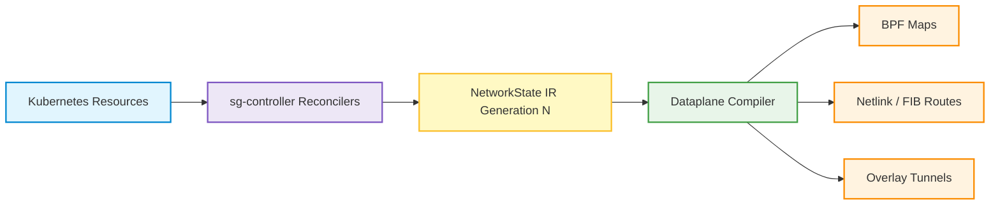

# Architecture of StraitKubeGateway

**StraitKubeGateway** separates control plane intent from kernel-level packet processing via a strictly typed Intermediate Representation (IR) and a single-writer Dataplane Compiler.

---

## 1. High-Level Architecture

```mermaid
graph TB
    subgraph K8sControlPlane["Kubernetes Control Plane"]
        API["Kubernetes API Server (port 6443)"]
        CRDs["StraitKubeGateway CRDs & Gateway API"]
        ConfigMaps["kubeadm-config / kube-proxy ConfigMaps"]
    end

    subgraph SGController["StraitKubeGateway Control Plane (sg-controller)"]
        GWMgr["Gateway Manager (Gateway API v1.6.1)"]
        SvcMgr["Service & EndpointSlice Manager"]
        PolEngine["Policy Engine (StraitNetworkPolicy)"]
        TransitMgr["Transit Gateway Manager (Segments 0..N)"]
        BGPMgr["BGP / BFD Manager"]
        IPAMDisc["Dynamic CIDR Discoverer"]
        IdAlloc["Identity Allocator"]
    end

    subgraph NodeAgent["Node Runtime (straitd DaemonSet)"]
        CNI["CNI Plugin (ADD / DEL / CHECK / GC)"]
        Platform["Platform (systemd notify, cgroup v2, sysctls)"]
        Compiler["Dataplane Compiler (Sole BPF / Netlink Writer)"]
        WG["WireGuard / IPsec Manager"]
        Metrics["Prometheus & Health Server (:9090)"]
    end

    subgraph KernelDataplane["Linux Kernel 6.7+ / 6.12 LTS Dataplane"]
        XDP["XDP Hook (DDoS & Early Filtering)"]
        NetKit["NetKit Device Pairs (Pod veth / Container Attachment)"]
        TCX["TCX / TC Ingress & Egress Hooks"]
        Sockops["Cgroup Socket Connect Hooks (sockops)"]
        BPFMaps["Pinned BPF Maps (/sys/fs/bpf/straitkubegateway)"]
        FIB["Linux FIB & Policy Routing"]
        Conntrack["Conntrack LRU Map"]
    end

    API -->|Watch / Informers| SGController
    CRDs -->|Reconcile| SGController
    ConfigMaps -->|Dynamic Discovery| IPAMDisc

    SGController -->|Normalized Network State| Compiler
    CNI -->|Allocate IP / Attach NetKit| NodeAgent
    Compiler -->|Program BPF Maps| BPFMaps
    Compiler -->|Program Routes & Tunnels| FIB

    NetKit -->|Fast Path Forwarding| TCX
    TCX -->|Maglev LB / DNAT| BPFMaps
    XDP -->|Early Ingress| BPFMaps
    Sockops -->|Socket-Level Acceleration| BPFMaps

    classDef k8s fill:#e1f5fe,stroke:#0288d1,stroke-width:2px,color:#01579b;
    classDef cp fill:#ede7f6,stroke:#7e57c2,stroke-width:2px,color:#311b92;
    classDef agent fill:#e8f5e9,stroke:#43a047,stroke-width:2px,color:#1b5e20;
    classDef kernel fill:#fff3e0,stroke:#fb8c00,stroke-width:2px,color:#e65100;

    class K8sControlPlane,API,CRDs,ConfigMaps k8s;
    class SGController,GWMgr,SvcMgr,PolEngine,TransitMgr,BGPMgr,IPAMDisc,IdAlloc cp;
    class NodeAgent,CNI,Platform,Compiler,WG,Metrics agent;
    class KernelDataplane,XDP,NetKit,TCX,Sockops,BPFMaps,FIB,Conntrack kernel;
```



---

## 2. Core Architectural Subsystems

### Control Plane (`sg-controller`)
The centralized controller manager runs as a Kubernetes Deployment with active leader election (`LeaderElectionID: "straitkubegateway-controller-leader"`). It translates Kubernetes resources into normalized desired state:
- **Gateway Manager**: Watches `GatewayClass`, `Gateway`, `HTTPRoute`, `TCPRoute`, `UDPRoute`, `GRPCRoute`, and `TLSRoute`. Resolves parent references and computes listener rules.
- **Service Manager**: Reconciles `corev1.Service` and `discoveryv1.EndpointSlice` objects into load balancer service definitions with Maglev backend tables.
- **Policy Engine**: Compiles `StraitNetworkPolicy` rules with multi-dimensional selectors (Namespace, Pod, Cluster, Segment, Gateway, HTTPRoute) into prioritized security identities.
- **Transit Manager**: Manages multi-cluster transit topologies across segments (Segment 0 backbone, Hub-and-Spoke, Mesh, Peer-to-Peer).
- **Dynamic IPAM Discoverer**: Inspects node specs and cluster configmaps on the fly without hardcoded subnets.

### Node Agent (`straitd`)
The per-node daemon agent runs as a privileged `DaemonSet` on every cluster node:
- **CNI Plugin**: Handles container runtime `ADD`, `DEL`, `CHECK`, `GC`, and `VERSION` requests under CNI Spec 1.1+.
- **Platform Manager**: Configures kernel network sysctls (`net.ipv4.ip_forward=1`, `net.core.bpf_jit_enable=1`), integrates with systemd watchdog (`sd_notify`), and attaches the process to cgroup v2.
- **Encryption Manager**: Generates Curve25519 (X25519) key pairs and manages WireGuard peers for pod-to-pod encryption.
- **Metrics Server**: Exposes Prometheus metrics and liveness/readiness probes on `:9090`.

---

## 3. Dataplane IR & Single-Writer Compiler Model

To prevent concurrency hazards and race conditions in the kernel, **no controller touches eBPF maps directly**. Instead, controllers generate a monotonically versioned **Intermediate Representation (IR)**:



### Invariants of the Compiler:
- **Idempotency**: Compiling the same state generation multiple times is safe and produces no side effects.
- **Atomic Promotion**: The compiler skips states if `state.Generation <= c.generation`.
- **Sole Authority**: BPF maps (`service_map`, `backend_map`, `policy_map`, `endpoint_map`, `ct_map`) and Linux routing tables are modified solely by `compiler.Compile()`.

---

## 4. Staged Architecture Phases

StraitKubeGateway is designed in 8 strictly decoupled stages where earlier phases never depend on later phases:

| Phase | Subsystem | Independence Rule |
|---|---|---|
| **Phase 1** | **CNI + Basic Routing** | Must NOT depend on Service LB, Transit, Policy, or Gateway convergence. |
| **Phase 2** | **Service LB** | In-kernel Maglev load balancing without kube-proxy dependencies. |
| **Phase 3** | **NAT & Conntrack** | SNAT, DNAT, Masquerade, and NAT64 translation. |
| **Phase 4** | **NetworkPolicy** | Stateful eBPF firewall with deterministic priority-based evaluation. |
| **Phase 5** | **Kube-Proxy Replacement** | Full standalone kube-proxy replacement (`kubeProxyReplacement: true`). |
| **Phase 6** | **Gateway API** | North-South ingress routing via Gateway API v1.6.1 standard. |
| **Phase 7** | **Transit Gateway** | Multi-cluster mesh and hub-spoke routing with segment isolation. |
| **Phase 8** | **BGP & BFD** | Dynamic BGP route advertisement and sub-second BFD failure detection. |

---

## 5. Kernel Hook Separation

StraitKubeGateway maintains strict architectural discipline regarding kernel hooks:

```
┌───────────────────────────────────────────────────────────────┐
│ FAST PATH (Forwarding & Acceleration)                         │
│   • NetKit: Pod and container namespace interface pairing     │
│   • TCX: Host-side ingress/egress packet processing           │
│   • XDP: Driver-level DDoS mitigation and early filtering     │
│   • BPF Maps: Pinned kernel dataplane state                   │
├───────────────────────────────────────────────────────────────┤
│ CONTROL & SECURITY                                            │
│   • cgroup v2: Socket creation hooks (connect4 / sockops)     │
│   • LSM: Kernel security enforcement                          │
├───────────────────────────────────────────────────────────────┤
│ OBSERVABILITY (Diagnostics only — NEVER for forwarding)       │
│   • tracepoints: Non-blocking network flow visibility         │
│   • kprobes: Runtime kernel troubleshooting                   │
│   • perf / ring buffers: Flow and drop event export           │
└───────────────────────────────────────────────────────────────┘
```
