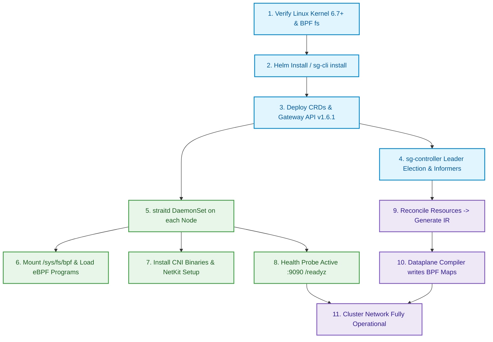

# Operator Guide: Install, Setup, Update & Test

This guide covers deploying, configuring, upgrading, uninstalling, and testing **StraitKubeGateway** on a Kubernetes cluster.

---

## 1. Prerequisites

| Requirement | Version / Details |
|---|---|
| **Kubernetes** | v1.30+ with API server accessible on `:6443` |
| **Linux Kernel** | 6.7+ (NetKit, TCX, XDP, cgroup v2), 6.12 LTS recommended |
| **Helm** | v3.14+ |
| **Container Runtime** | containerd 2.3.4+ (with runc 1.5.1+) or CRI-O 1.30+ |
| **Architecture** | `amd64` or `arm64` |
| **Cluster Access** | `kubectl` configured with `cluster-admin` privileges |

### Kernel Features Verification

Verify that required kernel features are available:

```bash
# Check kernel version
uname -r   # expect >= 6.7

# Verify BPF JIT and cgroup v2
cat /proc/sys/net/core/bpf_jit_enable        # should be 1
mount | grep cgroup2                          # should show cgroup2 mount
ls /sys/fs/bpf/                               # BPF filesystem should be mounted
```

---

## 2. Installation

### Installation & Bootstrap Flowchart



### Option A: Helm Chart (Recommended)

```bash
# Add the StraitKubeGateway Helm repository
helm repo add straitkubegateway https://msaeedb40.github.io/straitKubegateway
helm repo update

# Install with default configuration
helm upgrade --install straitkubegateway straitkubegateway/straitkubegateway \
  --namespace kube-system \
  --create-namespace

# Install with custom values
helm upgrade --install straitkubegateway straitkubegateway/straitkubegateway \
  --namespace kube-system \
  --set global.clusterName="production-east" \
  --set straitd.wireguard.enabled=true \
  --set gatewayAPI.enabled=true \
  --set transit.enabled=true \
  --set transit.segmentID=0 \
  --set transit.topology=mesh
```

### Option B: sg-cli (CLI Management Tool)

Install `sg-cli` with auto-detection for Linux (`amd64` / `arm64`) and macOS:

```bash
# 1. One-line automated install
curl -fsSL https://raw.githubusercontent.com/msaeedb40/straitKubegateway/developer/scripts/sg-cli/install.sh | bash

# 2. Deploy StraitKubeGateway to the cluster
sg-cli install --namespace kube-system --set wireguard.enabled=true
```

### Option C: Local Helm Chart

```bash
# From the project root
helm upgrade --install straitkubegateway ./straitKubegateway-helm-repo \
  --namespace kube-system \
  --create-namespace
```

---

## 3. Post-Installation Setup

### Verify Deployment

```bash
# Check that all pods are running
kubectl get pods -n kube-system -l app.kubernetes.io/name=straitkubegateway

# Check DaemonSet status (straitd should be running on every node)
kubectl get ds -n kube-system

# Check Controller Deployment
kubectl get deploy -n kube-system -l component=sg-controller

# Verify CRDs are installed
kubectl get crds | grep straitkubegateway
```

### Verify Node Agent Health

```bash
# Check readiness on a specific node
kubectl exec -n kube-system <straitd-pod> -- wget -qO- http://localhost:9090/readyz
kubectl exec -n kube-system <straitd-pod> -- wget -qO- http://localhost:9090/healthz

# Check cluster-wide status
sg-cli status
```

### Disable kube-proxy (When Using Kube-Proxy Replacement)

If deploying with `kubeProxyReplacement: true` (default):

```bash
# Scale down kube-proxy
kubectl -n kube-system patch daemonset kube-proxy \
  -p '{"spec": {"template": {"spec": {"nodeSelector": {"non-existing": "true"}}}}}'
```

---

## 4. Platform Deployments

StraitKubeGateway provides turnkey scripts and recipes for local development and bare-metal production clusters:

### 4.1 Kind (Kubernetes in Docker)

```bash
# 1. Create Kind cluster (disables kindnet and kube-proxy)
scripts/kind/create-cluster.sh

# 2. Build and install StraitKubeGateway
scripts/kind/install.sh
```

### 4.2 K3s / k3d

```bash
# 1. Create K3s cluster via k3d (flannel & traefik disabled)
scripts/k3s/create-cluster.sh

# 2. Build and install StraitKubeGateway
scripts/k3s/install.sh
```

### 4.3 Minikube

```bash
# 1. Create Minikube cluster (driver: docker, containerd CRI, --cni=false, --wait=apiserver)
scripts/minikube/create-cluster.sh

# 2. Build and install StraitKubeGateway
scripts/minikube/install.sh
```

### 4.4 Kubeadm Bare-Metal & VM Deployment

For production bare-metal or cloud VMs (Ubuntu 22.04/24.04, Debian 12):

#### Step 1: Host Kernel Preparation
```bash
sudo swapoff -a
sudo sed -i '/ swap / s/^\(.*\)$/#\1/g' /etc/fstab

cat <<EOF | sudo tee /etc/modules-load.d/k8s.conf
overlay
br_netfilter
EOF
sudo modprobe overlay
sudo modprobe br_netfilter

cat <<EOF | sudo tee /etc/sysctl.d/k8s.conf
net.bridge.bridge-nf-call-iptables  = 1
net.bridge.bridge-nf-call-ip6tables = 1
net.ipv4.ip_forward                 = 1
net.ipv6.conf.all.forwarding        = 1
EOF
sudo sysctl --system
```

#### Step 2: Install Container Runtime Interface (containerd v2.3.4 & runc v1.5.1)
```bash
# Download and unpack containerd v2.3.4
curl -LO https://github.com/containerd/containerd/releases/download/v2.3.4/containerd-2.3.4-linux-amd64.tar.gz
sudo tar Cxzvf /usr/local containerd-2.3.4-linux-amd64.tar.gz

# Install systemd service unit
curl -LO https://raw.githubusercontent.com/containerd/containerd/main/containerd.service
sudo mkdir -p /usr/local/lib/systemd/system/
sudo mv containerd.service /usr/local/lib/systemd/system/

# Configure containerd with SystemdCgroup enabled
sudo mkdir -p /etc/containerd
containerd config default | sudo tee /etc/containerd/config.toml
sudo sed -i 's/SystemdCgroup \= false/SystemdCgroup \= true/g' /etc/containerd/config.toml

# Download & install runc v1.5.1
curl -LO https://github.com/opencontainers/runc/releases/download/v1.5.1/runc.amd64
sudo install -m 755 runc.amd64 /usr/local/sbin/runc

# Download & configure crictl v1.36.0 for containerd
curl -LO https://github.com/kubernetes-sigs/cri-tools/releases/download/v1.36.0/crictl-v1.36.0-linux-amd64.tar.gz
sudo tar zxvf crictl-v1.36.0-linux-amd64.tar.gz -C /usr/local/bin
sudo crictl config runtime-endpoint unix:///var/run/containerd/containerd.sock

# Reload systemd and start containerd
sudo systemctl daemon-reload
sudo systemctl enable --now containerd
```

#### Step 3: Install Standard CNI Reference Plugins
```bash
CNI_PLUGINS_VERSION="v1.6.2"
sudo mkdir -p /opt/cni/bin
curl -LO "https://github.com/containernetworking/plugins/releases/download/${CNI_PLUGINS_VERSION}/cni-plugins-linux-amd64-${CNI_PLUGINS_VERSION}.tgz"
sudo tar -Cxzvf /opt/cni/bin "cni-plugins-linux-amd64-${CNI_PLUGINS_VERSION}.tgz"

sudo mkdir -p /etc/cni/net.d
```

#### Step 4: Install Kubelet, Kubeadm & Kubectl
```bash
sudo apt-get update && sudo apt-get install -y apt-transport-https ca-certificates curl gpg
sudo mkdir -p /etc/apt/keyrings
sudo rm -f /etc/apt/keyrings/kubernetes-apt-keyring.gpg
curl -fsSL https://pkgs.k8s.io/core:/stable:/v1.32/deb/Release.key | sudo gpg --batch --yes --dearmor -o /etc/apt/keyrings/kubernetes-apt-keyring.gpg
echo "deb [signed-by=/etc/apt/keyrings/kubernetes-apt-keyring.gpg] https://pkgs.k8s.io/core:/stable:/v1.32/deb/ /" | sudo tee /etc/apt/sources.list.d/kubernetes.list

sudo apt-get update
sudo apt-get install -y kubelet=1.32.0-* kubeadm=1.32.0-* kubectl=1.32.0-*
sudo apt-mark hold kubelet kubeadm kubectl
```

#### Step 5: Initialize Control Plane (Skipping kube-proxy)
```bash
sudo kubeadm init \
  --kubernetes-version=v1.32.0 \
  --pod-network-cidr=10.18.0.0/16 \
  --apiserver-advertise-address=192.168.56.3 \
  --skip-phases=addon/kube-proxy \
  --node-name master \
  --ignore-preflight-errors=NumCPU,Mem

# Setup kubeconfig
sudo chmod 755 /etc/kubernetes/admin.conf
export KUBECONFIG=/etc/kubernetes/admin.conf

mkdir -p $HOME/.kube
sudo cp -i /etc/kubernetes/admin.conf $HOME/.kube/config
sudo chown $(id -u):$(id -g) $HOME/.kube/config

# Untaint control-plane for scheduling
kubectl taint nodes --all node-role.kubernetes.io/control-plane- || true
```

#### Step 6: Join Worker Nodes (Multi-Node)
```bash
# Run on worker nodes
sudo kubeadm join 192.168.56.3:6443 --token <token> --discovery-token-ca-cert-hash sha256:<hash>

# Regenerate token if needed on master:
kubeadm token create --print-join-command
```

#### Step 7: Deploy StraitKubeGateway via Helm
```bash
kubectl apply --server-side --force-conflicts -f \
  https://github.com/kubernetes-sigs/gateway-api/releases/download/v1.6.1/standard-install.yaml

helm repo add straitkubegateway https://msaeedb40.github.io/straitKubegateway
helm repo update

helm install straitkubegateway straitkubegateway/straitkubegateway \
  --namespace kube-system \
  --set straitd.kubeProxyReplacement=true \
  --set straitd.kubeProxyMode=none \
  --set straitd.wireguard.enabled=true \
  --wait --timeout 300s
```

---

## 5. Observability Suite

Deploy Prometheus Operator, Grafana, and StraitKubeGateway telemetry:

```bash
# 1. Deploy Prometheus Operator & Grafana (pinned chart version 88.6.4)
helm repo add prometheus-community https://prometheus-community.github.io/helm-charts
helm repo update

helm install prometheus-stack prometheus-community/kube-prometheus-stack \
  --namespace monitoring \
  --create-namespace \
  --version 88.6.4 \
  --set prometheus.prometheusSpec.serviceMonitorSelectorNilUsesHelmValues=false \
  --set prometheus.prometheusSpec.podMonitorSelectorNilUsesHelmValues=false

# 2. Retrieve Grafana admin credentials
kubectl get secret -n monitoring prometheus-stack-grafana -o jsonpath="{.data.admin-password}" | base64 --decode && echo

# 3. Port-forward Grafana to localhost:3000
kubectl port-forward -n monitoring svc/prometheus-stack-grafana 3000:80
```

---

## 6. Configuration Reference

### Key Helm Values

| Key | Default | Description |
|---|---|---|
| `straitd.kubeProxyReplacement` | `true` | Enable complete kube-proxy replacement |
| `straitd.kubeProxyMode` | `"none"` | kube-proxy compatibility mode |
| `straitd.networking.tunnelMode` | `vxlan` | Overlay tunnel mode (`vxlan`, `geneve`, `gre`, `disabled`) |
| `straitd.networking.mtu` | `0` | MTU (0 = auto-discover) |
| `straitd.networking.enableIPv6` | `false` | Enable IPv6 dual-stack |
| `straitd.networking.podCIDR` | `""` | Pod CIDR (empty = auto-discover) |
| `straitd.networking.serviceCIDR` | `""` | Service CIDR (empty = auto-discover) |
| `straitd.wireguard.enabled` | `true` | Enable WireGuard pod-to-pod encryption |
| `straitd.wireguard.port` | `51820` | WireGuard UDP listen port |
| `straitd.metrics.port` | `9090` | Prometheus metrics port |
| `sgController.replicas` | `2` | Controller manager replicas (HA) |
| `gatewayAPI.enabled` | `false` | Enable Gateway API v1.6.1 support |
| `gatewayAPI.gatewayClassName` | `strait-class` | Default GatewayClass name |
| `transit.enabled` | `false` | Enable multi-cluster transit gateway |
| `transit.segmentID` | `0` | Local transit segment ID |
| `transit.topology` | `hub-spoke` | Transit topology (`hub-spoke`, `mesh`, `peer-to-peer`) |

---

## 7. Upgrade

```bash
# Update Helm repository
helm repo update

# Upgrade to the latest version
helm upgrade --install straitkubegateway straitkubegateway/straitkubegateway \
  --namespace kube-system \
  --reuse-values

# Or upgrade with new values
helm upgrade --install straitkubegateway straitkubegateway/straitkubegateway \
  --namespace kube-system \
  --set transit.enabled=true \
  --set transit.topology=mesh

# Using sg-cli
sg-cli upgrade --namespace kube-system
```

---

## 8. Uninstall

```bash
# Uninstall via Helm
helm uninstall straitkubegateway --namespace kube-system

# Clean up BPF filesystem artifacts
kubectl get nodes -o name | xargs -I {} kubectl debug {} \
  -- rm -rf /sys/fs/bpf/straitkubegateway

# Remove CRDs (if not managed by Helm hooks)
kubectl delete crds --selector=app.kubernetes.io/name=straitkubegateway

# Re-enable kube-proxy if needed
kubectl -n kube-system patch daemonset kube-proxy \
  -p '{"spec": {"template": {"spec": {"nodeSelector": null}}}}'
```

---

## 9. Testing

### Unit Tests

```bash
# Run all Go unit tests with race detection
cd straitKubegateway/
go test -v -race ./...
```

### Go Vet & Lint

```bash
go vet ./...
```

### Helm Chart Validation

```bash
# Lint the Helm chart
helm lint straitKubegateway-helm-repo

# Render templates (dry-run validation)
helm template straitkubegateway straitKubegateway-helm-repo
```

### End-to-End Tests

```bash
# Run e2e test suite
go test -v ./test/e2e/...

# Run conformance tests
go test -v ./test/conformance/...
```

### BPF Program Build Validation

```bash
# Build eBPF C programs (requires clang 22+)
make -C bpf/

# Verify BPF object files
llvm-objdump -S bpf/obj/xdp_ingress.o
```

---

## 10. Troubleshooting

| Symptom | Likely Cause | Fix |
|---|---|---|
| Pod stuck in `ContainerCreating` | CNI binary not installed or BPF filesystem not mounted | Check `/opt/cni/bin/straitkubegateway` exists and `/sys/fs/bpf` is mounted |
| Service VIPs unreachable | kube-proxy still running alongside StraitKubeGateway | Scale down kube-proxy DaemonSet |
| `RBAC: forbidden` errors | Missing ClusterRoleBindings | Verify `kubectl get clusterrolebinding -l app.kubernetes.io/name=straitkubegateway` |
| Pod networking but no DNS | CoreDNS service not programmed in eBPF maps | Check `sg-cli status` and verify `service_map` contains kube-dns VIP |
| WireGuard handshake failures | Invalid public key or port blocked | Verify `sg-cli wireguard` output and ensure UDP 51820 is open between nodes |
