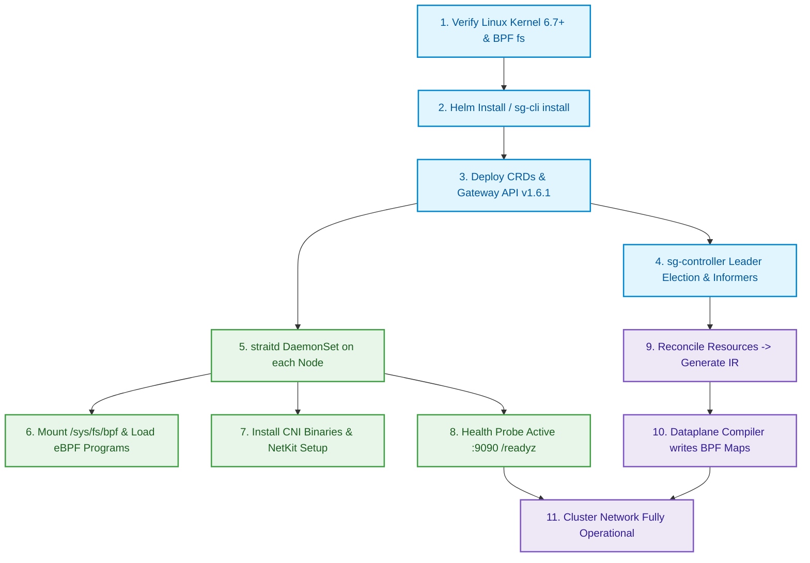

# Operator Guide: Install, Setup, Update & Test

This guide covers deploying, configuring, upgrading, uninstalling, and testing **StraitKubeGateway** on a Kubernetes cluster.

---

## 1. Prerequisites

| Requirement | Version / Details |
|---|---|
| **Kubernetes** | v1.30+ with API server accessible on `:6443` |
| **Linux Kernel** | 6.7+ (NetKit, TCX, XDP, cgroup v2), 6.12 LTS recommended |
| **Helm** | v3.14+ |
| **Container Runtime** | containerd 1.7+ or CRI-O 1.30+ |
| **Architecture** | `amd64` or `arm64` |
| **Cluster Access** | `kubectl` configured with `cluster-admin` privileges |

### Kernel Features Verification

Verify that required kernel features are available:

```bash
# Check kernel version
uname -r   # expect >= 6.7

# Verify BPF JIT and cgroup v2
cat /proc/sys/net/core/bpf_jit_enable        # should be 1
mount | grep cgroup2                          # should show cgroup2 mount
ls /sys/fs/bpf/                               # BPF filesystem should be mounted
```

---

## 2. Installation

### Installation & Bootstrap Flowchart



### Option A: Helm Chart (Recommended)

```bash
# Add the StraitKubeGateway Helm repository
helm repo add straitkubegateway https://charts.straitkubegateway.io
helm repo update

# Install with default configuration
helm upgrade --install straitkubegateway straitkubegateway/straitkubegateway \
  --namespace kube-system \
  --create-namespace

# Install with custom values
helm upgrade --install straitkubegateway straitkubegateway/straitkubegateway \
  --namespace kube-system \
  --set global.clusterName="production-east" \
  --set straitd.wireguard.enabled=true \
  --set gatewayAPI.enabled=true \
  --set transit.enabled=true \
  --set transit.segmentID=0 \
  --set transit.topology=mesh
```

### Option B: sg-cli

```bash
sg-cli install --namespace kube-system --set wireguard.enabled=true
```

### Option C: Local Helm Chart

```bash
# From the project root
helm upgrade --install straitkubegateway ./straitKubegateway-helm-repo \
  --namespace kube-system \
  --create-namespace
```

---

## 3. Post-Installation Setup

### Verify Deployment

```bash
# Check that all pods are running
kubectl get pods -n kube-system -l app.kubernetes.io/name=straitkubegateway

# Check DaemonSet status (straitd should be running on every node)
kubectl get ds -n kube-system

# Check Controller Deployment
kubectl get deploy -n kube-system -l component=sg-controller

# Verify CRDs are installed
kubectl get crds | grep straitkubegateway
```

### Verify Node Agent Health

```bash
# Check readiness on a specific node
kubectl exec -n kube-system <straitd-pod> -- wget -qO- http://localhost:9090/readyz
kubectl exec -n kube-system <straitd-pod> -- wget -qO- http://localhost:9090/healthz

# Check cluster-wide status
sg-cli status
```

### Disable kube-proxy (When Using Kube-Proxy Replacement)

If deploying with `kubeProxyReplacement: true` (default):

```bash
# Scale down kube-proxy
kubectl -n kube-system patch daemonset kube-proxy \
  -p '{"spec": {"template": {"spec": {"nodeSelector": {"non-existing": "true"}}}}}'
```

---

## 4. Configuration Reference

### Key Helm Values

| Key | Default | Description |
|---|---|---|
| `straitd.kubeProxyReplacement` | `true` | Enable complete kube-proxy replacement |
| `straitd.kubeProxyMode` | `"none"` | kube-proxy compatibility mode |
| `straitd.networking.tunnelMode` | `vxlan` | Overlay tunnel mode (`vxlan`, `geneve`, `gre`, `disabled`) |
| `straitd.networking.mtu` | `0` | MTU (0 = auto-discover) |
| `straitd.networking.enableIPv6` | `false` | Enable IPv6 dual-stack |
| `straitd.networking.podCIDR` | `""` | Pod CIDR (empty = auto-discover) |
| `straitd.networking.serviceCIDR` | `""` | Service CIDR (empty = auto-discover) |
| `straitd.wireguard.enabled` | `true` | Enable WireGuard pod-to-pod encryption |
| `straitd.wireguard.port` | `51820` | WireGuard UDP listen port |
| `straitd.metrics.port` | `9090` | Prometheus metrics port |
| `sgController.replicas` | `2` | Controller manager replicas (HA) |
| `gatewayAPI.enabled` | `false` | Enable Gateway API v1.6.1 support |
| `gatewayAPI.gatewayClassName` | `strait-class` | Default GatewayClass name |
| `transit.enabled` | `false` | Enable multi-cluster transit gateway |
| `transit.segmentID` | `0` | Local transit segment ID |
| `transit.topology` | `hub-spoke` | Transit topology (`hub-spoke`, `mesh`, `peer-to-peer`) |

---

## 5. Upgrade

```bash
# Update Helm repository
helm repo update

# Upgrade to the latest version
helm upgrade --install straitkubegateway straitkubegateway/straitkubegateway \
  --namespace kube-system \
  --reuse-values

# Or upgrade with new values
helm upgrade --install straitkubegateway straitkubegateway/straitkubegateway \
  --namespace kube-system \
  --set transit.enabled=true \
  --set transit.topology=mesh

# Using sg-cli
sg-cli upgrade --namespace kube-system
```

---

## 6. Uninstall

```bash
# Uninstall via Helm
helm uninstall straitkubegateway --namespace kube-system

# Clean up BPF filesystem artifacts
kubectl get nodes -o name | xargs -I {} kubectl debug {} \
  -- rm -rf /sys/fs/bpf/straitkubegateway

# Remove CRDs (if not managed by Helm hooks)
kubectl delete crds --selector=app.kubernetes.io/name=straitkubegateway

# Re-enable kube-proxy if needed
kubectl -n kube-system patch daemonset kube-proxy \
  -p '{"spec": {"template": {"spec": {"nodeSelector": null}}}}'
```

---

## 7. Testing

### Unit Tests

```bash
# Run all Go unit tests with race detection
cd straitKubegateway/
go test -v -race ./...
```

### Go Vet & Lint

```bash
go vet ./...
```

### Helm Chart Validation

```bash
# Lint the Helm chart
helm lint straitKubegateway-helm-repo

# Render templates (dry-run validation)
helm template straitkubegateway straitKubegateway-helm-repo
```

### End-to-End Tests

```bash
# Run e2e test suite
go test -v ./test/e2e/...

# Run conformance tests
go test -v ./test/conformance/...
```

### BPF Program Build Validation

```bash
# Build eBPF C programs (requires clang 22+)
make -C bpf/

# Verify BPF object files
llvm-objdump -S bpf/obj/xdp_ingress.o
```

---

## 8. Troubleshooting

| Symptom | Likely Cause | Fix |
|---|---|---|
| Pod stuck in `ContainerCreating` | CNI binary not installed or BPF filesystem not mounted | Check `/opt/cni/bin/straitkubegateway` exists and `/sys/fs/bpf` is mounted |
| Service VIPs unreachable | kube-proxy still running alongside StraitKubeGateway | Scale down kube-proxy DaemonSet |
| `RBAC: forbidden` errors | Missing ClusterRoleBindings | Verify `kubectl get clusterrolebinding -l app.kubernetes.io/name=straitkubegateway` |
| Pod networking but no DNS | CoreDNS service not programmed in eBPF maps | Check `sg-cli status` and verify `service_map` contains kube-dns VIP |
| WireGuard handshake failures | Invalid public key or port blocked | Verify `sg-cli wireguard` output and ensure UDP 51820 is open between nodes |
