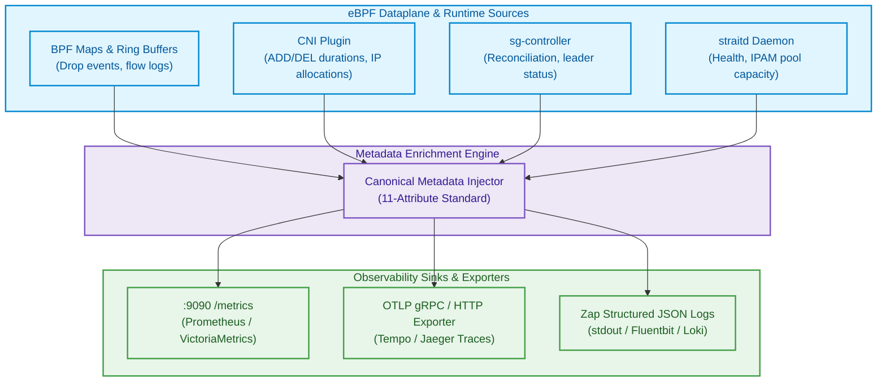

# Observability in StraitKubeGateway

StraitKubeGateway implements a unified observability architecture built on a **canonical metadata model** that propagates consistently across logs, metrics, traces, flow events, policy decisions, and transit events.

---

## 1. Canonical Metadata Model

Every telemetry signal emitted by StraitKubeGateway carries a standardized 11-attribute metadata structure. This ensures dimensional consistency across all observability backends:

| Attribute | Type | Description |
|---|---|---|
| `cluster_id` | `string` | Unique cluster identifier for multi-cluster correlation |
| `node_id` | `string` | Kubernetes node name (from `spec.nodeName`) |
| `namespace` | `string` | Kubernetes namespace of the subject resource |
| `pod` | `string` | Pod name generating or receiving the event |
| `service` | `string` | Associated Kubernetes Service name |
| `endpoint` | `string` | Backend endpoint IP:port tuple |
| `flow_id` | `uint64` | Unique 5-tuple flow hash for conntrack correlation |
| `trace_id` | `string` | Distributed trace identifier (W3C Trace Context) |
| `policy_id` | `string` | StraitNetworkPolicy identifier that evaluated the flow |
| `segment_id` | `uint32` | Transit segment ID (0 = backbone) |
| `gateway_id` | `string` | Gateway API resource name for north-south traffic |

### Telemetry Pipeline Architecture



---

## 2. Prometheus Metrics

The `straitd` daemon exposes Prometheus metrics on port `:9090` at the `/metrics` endpoint.

### Core Metric Families

#### Dataplane Metrics
| Metric Name | Type | Labels | Description |
|---|---|---|---|
| `straitkubegateway_dataplane_compilations_total` | Counter | `result` | Total dataplane IR compilations (success/error) |
| `straitkubegateway_dataplane_compilation_duration_seconds` | Histogram | — | Time per compilation cycle |
| `straitkubegateway_bpf_map_operations_total` | Counter | `map`, `op`, `result` | BPF map update/lookup/delete operations |
| `straitkubegateway_bpf_map_entries` | Gauge | `map` | Current entry count per BPF map |

#### CNI Metrics
| Metric Name | Type | Labels | Description |
|---|---|---|---|
| `straitkubegateway_cni_operations_total` | Counter | `op`, `result` | CNI ADD/DEL/CHECK/GC calls |
| `straitkubegateway_cni_operation_duration_seconds` | Histogram | `op` | Latency per CNI operation |

#### Service Load Balancer Metrics
| Metric Name | Type | Labels | Description |
|---|---|---|---|
| `straitkubegateway_service_endpoints` | Gauge | `service`, `namespace` | Active backend endpoints per service |
| `straitkubegateway_service_lb_selections_total` | Counter | `service`, `algorithm` | Backend selection events by algorithm |

#### Policy Engine Metrics
| Metric Name | Type | Labels | Description |
|---|---|---|---|
| `straitkubegateway_policy_evaluations_total` | Counter | `action`, `direction` | Policy verdicts (Allow/Deny/Reject) |
| `straitkubegateway_policy_compiled_rules` | Gauge | — | Total compiled IR policy rules |

#### Transit & BGP Metrics
| Metric Name | Type | Labels | Description |
|---|---|---|---|
| `straitkubegateway_transit_peers` | Gauge | `segment_id` | Active transit peers per segment |
| `straitkubegateway_bgp_prefixes_advertised` | Gauge | `peer` | Prefixes advertised to each BGP peer |
| `straitkubegateway_bfd_session_state` | Gauge | `peer`, `state` | BFD session state (Up/Down/Init) |

#### IPAM Metrics
| Metric Name | Type | Labels | Description |
|---|---|---|---|
| `straitkubegateway_ipam_allocated_ips` | Gauge | `cidr`, `family` | Allocated IPs per pool |
| `straitkubegateway_ipam_pool_capacity` | Gauge | `cidr`, `family` | Total capacity per pool |

### 2.1 Deploying Prometheus & Grafana with Helm

To deploy the Prometheus Operator stack alongside StraitKubeGateway:

```bash
# 1. Add Prometheus Community Helm repository
helm repo add prometheus-community https://prometheus-community.github.io/helm-charts
helm repo update

# 2. Install kube-prometheus-stack with pinned chart version
helm install prometheus prometheus-community/kube-prometheus-stack \
  --version 88.6.4 \
  --namespace monitoring \
  --create-namespace

# 3. Deploy StraitKubeGateway with ServiceMonitors and Dashboards enabled
helm install straitkubegateway straitkubegateway/straitkubegateway \
  --namespace kube-system \
  --set metrics.serviceMonitor.enabled=true \
  --set metrics.prometheusRule.enabled=true \
  --set grafana.dashboards.enabled=true \
  --set grafana.dashboards.namespace=monitoring
```

---

## 3. Health & Readiness Probes

The `straitd` DaemonSet exposes HTTP health endpoints on port `:9090`:

| Endpoint | Purpose | Probe Type |
|---|---|---|
| `/healthz` | Confirms `straitd` process is alive and responsive | Liveness Probe |
| `/readyz` | Confirms CNI is initialized, BPF programs are loaded, and IPAM pools are seeded | Readiness Probe |
| `/metrics` | Prometheus scrape endpoint | Monitoring |

---

## 4. Structured Logging

All StraitKubeGateway components use structured JSON logging via `go.uber.org/zap`:

```json
{
  "level": "info",
  "ts": "2026-08-26T10:30:00.123Z",
  "caller": "controllers/service_controller.go:87",
  "msg": "service reconciled",
  "namespace": "production",
  "name": "orders-api",
  "endpoints": 5,
  "algorithm": "maglev",
  "generation": 42
}
```

### Log Levels
| Level | Usage |
|---|---|
| `debug` | BPF map operation details, conntrack flow lifecycle, route table diffs |
| `info` | Controller reconciliation events, CNI ADD/DEL completions, BGP peering state changes |
| `warn` | Degraded states (e.g., IPAM pool nearing exhaustion, BFD session flapping) |
| `error` | Failed BPF program loads, CNI errors, RBAC authorization failures |

---

## 5. Flow Events & eBPF Ring Buffers

StraitKubeGateway exports per-packet flow events and policy decisions through eBPF perf and ring buffer channels:

- **Flow Event Fields**: `src_ip`, `dst_ip`, `src_port`, `dst_port`, `protocol`, `identity`, `policy_id`, `action` (Allow/Deny), `direction` (Ingress/Egress), `bytes`, `timestamp_ns`.
- **Drop Reason Codes**: Exported with each dropped packet for troubleshooting (e.g., `POLICY_DENIED`, `CT_MAP_FULL`, `NO_BACKEND`, `INVALID_PACKET`).

---

## 6. Distributed Tracing (OpenTelemetry)

StraitKubeGateway supports W3C Trace Context propagation:
- **Trace Spans**: Gateway API request processing, service backend selection, policy evaluation, and transit forwarding decisions are emitted as individual spans.
- **Integration**: Compatible with Jaeger, Zipkin, Tempo, and any OpenTelemetry Protocol (OTLP) collector.
