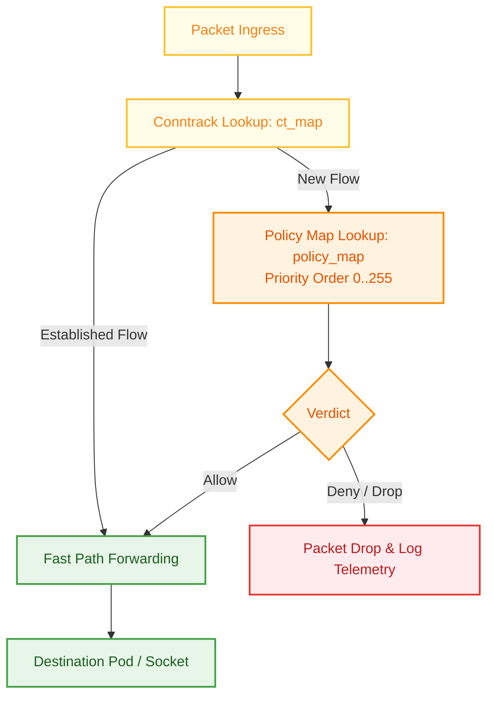

# Security Architecture & Policies

Security in **StraitKubeGateway** is engineered with a defense-in-depth model spanning Linux kernel capabilities, Kubernetes RBAC least-privilege boundaries, deterministic stateful firewall policies, and cryptographic overlay encryption.

---

## 1. Linux Kernel Capability Model

The `straitd` daemon runs with strictly bounded Linux capabilities required for eBPF map loading, netlink route programming, and network namespace switching. All unnecessary capabilities are dropped (`drop: ALL`):

| Linux Capability | Required Purpose in StraitKubeGateway |
|---|---|
| `CAP_NET_ADMIN` | Network interface creation (NetKit), IP routing, TC attachment, and firewall rules. |
| `CAP_SYS_ADMIN` | BPF filesystem (`bpffs`) mount management, cgroup v2 control, and namespace transitions. |
| `CAP_NET_RAW` | Raw socket creation for BFD/BGP packet transmission and ping health probes. |
| `CAP_PERFMON` | Performance monitoring and eBPF perf event buffer access. |
| `CAP_BPF` | eBPF program verification, loading, and map manipulation without root privilege escalation. |
| `CAP_SYS_RESOURCE`| Adjusting memory locking limits (`RLIMIT_MEMLOCK`) for pinned eBPF maps. |
| `CAP_SYS_PTRACE` | Inspecting process metadata for container network namespace discovery. |

---

## 2. Kubernetes RBAC & Least-Privilege

StraitKubeGateway splits controller and daemon permissions across two distinct ServiceAccounts and ClusterRoles:

### `sg-controller` Role
- **Core Resources**: `get`, `list`, `watch`, `update`, `patch` on `nodes`, `services`, `namespaces`, `configmaps`, `endpoints`, `leases`.
- **Discovery**: `get`, `list`, `watch` on `discovery.k8s.io/endpointslices`.
- **Gateway API**: Full lifecycle permissions on `gateway.networking.k8s.io/*` resources (`gateways`, `httproutes`, `tcproutes`, `udproutes`, `grpcroutes`, `tlsroutes`).
- **StraitKubeGateway CRDs**: Full lifecycle permissions on `straitkubegateway.io/*` resources.

### `straitd` Daemon Role
- **Read-Only Discovery**: `get`, `list`, `watch` on `nodes`, `pods`, `namespaces`, and `configmaps`.
- **Status Updates**: `update`, `patch` on `straitnodes/status`, `straitnetworks/status`, and `straitnetworkpolicies/status`.

---

## 3. Stateful Policy Engine & Deterministic Compiler

`StraitNetworkPolicy` provides advanced multi-dimensional identity-based firewall rules enforced at the eBPF layer.

### Deterministic Compiler Rules:
1. **Rule Priority Order**: Rules are evaluated strictly by priority (0–255, where `0` is highest priority and evaluated first).
2. **Deny-by-Default Ingress**: When a pod is selected by a policy, all unapproved incoming traffic is blocked (`Deny`).
3. **Allow-by-Default Egress**: Outbound connections are permitted unless explicit egress rules restrict them.
4. **Deny Overrides Allow**: At equal priority levels, a `Deny` rule takes precedence over an `Allow` rule.
5. **Multi-Dimensional Matching**:
   - `PodSelector` & `NamespaceSelector`
   - `ClusterSelector` (Cross-cluster identity)
   - `SegmentSelector` (Transit segment isolation)
   - `GatewaySelector` & `HTTPRouteSelector` (Gateway API traffic filtering)

---

## 4. End-to-End Encryption

StraitKubeGateway provides zero-trust transparent encryption for inter-pod and inter-node traffic:

### WireGuard Tunneling
- **Key Exchange**: RFC 7748 compliant Curve25519 (`crypto/ecdh.X25519()`) key generation.
- **Symmetric Encryption**: ChaCha20-Poly1305 authenticated encryption.
- **Automated Peer Discovery**: Node public keys and AllowedIPs are automatically synchronized via `StraitNode` CRDs.

### IPsec ESP
- **Encapsulation**: IPsec Encapsulating Security Payload (ESP, IP protocol 50).
- **Ciphers**: AES-GCM (128/256-bit) and HMAC-SHA256 authenticated integrity.
- **Hardware Acceleration**: Automatically utilizes CPU AES-NI instructions for near line-rate encryption.

---

## 5. Linux Namespace Isolation & Thread Safety

To guarantee that goroutines never pollute the host network namespace during pod configuration:
- `platform.NetNS.Do` enforces `runtime.LockOSThread()` before invoking `unix.Setns()`.
- Thread unlocking is deferred (`defer runtime.UnlockOSThread()`) only after reverting to the original root namespace.
- Prevents cross-namespace socket leakage and race conditions during concurrent CNI ADD operations.
