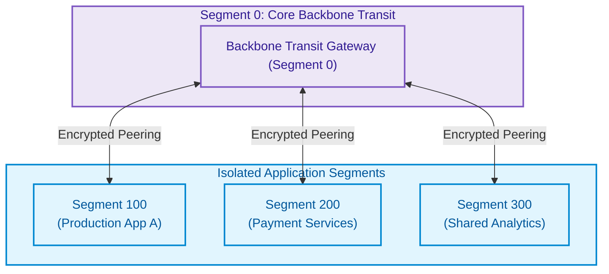
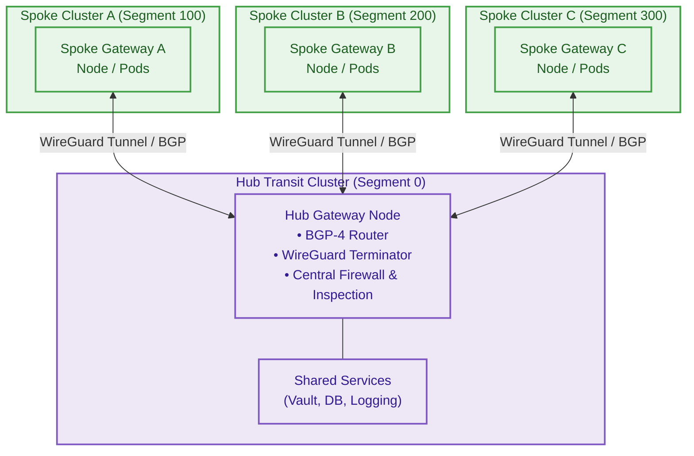
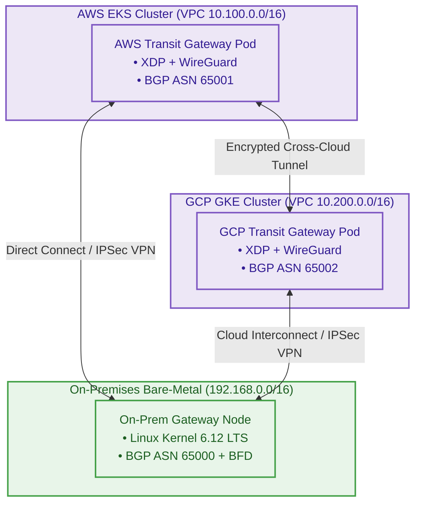
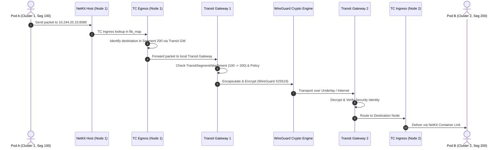

# Multi-Cluster Transit Gateway & Topologies

**StraitKubeGateway** includes a native, high-performance multi-cluster transit gateway that provides cross-cluster networking, 32-bit segment isolation, BGP-4 dynamic routing, sub-second BFD failover, and automated WireGuard/IPsec encryption.

---

## 1. Core Transit Networking Model

StraitKubeGateway uses a **segment-based network model** built upon 32-bit unsigned segment identifiers (`0` to `4,294,967,295`):



### Segment Rules & Invariants

1. **Segment IDs**: 32-bit unsigned integers (`uint32`) ranging from `0` to `4,294,967,295`.
2. **Backbone Segment `0`**: Segment `0` is reserved as the universal transit backbone.
3. **Default Zero-Trust Isolation**: All segments are isolated by default. Connecting to the backbone does not automatically grant inter-segment reachability.
4. **Explicit Routing Relationships**: Segment-to-segment communication requires explicit `TransitSegmentAttachment` or `StraitNetworkPolicy` bindings.
5. **Cross-Cluster Identity Preservation**: Workload numeric security identities are embedded in tunnel headers, preserving policy enforcement across cluster boundaries.

---

## 2. Supported Topologies

StraitKubeGateway supports four primary multi-cluster transit topologies:

### Topology 1: Hub-and-Spoke

In a Hub-and-Spoke topology, a central **Hub Gateway** (running on Segment `0`) acts as the transit router, security inspection engine, and shared service aggregator for multiple spoke clusters.



#### Key Characteristics & Use Cases:
- **Centralized Security Inspection**: All inter-spoke traffic (`Spoke A → Hub → Spoke B`) traverses the Hub's eBPF policy engine.
- **Shared Enterprise Services**: Direct access to identity, vault, logging, and databases without duplicating services.
- **Controlled Egress**: Centralized internet breakout and NAT gateways.

---

### Topology 2: Full Mesh

In a Full Mesh topology, every cluster gateway establishes direct encrypted tunnels and BGP sessions with every other participating cluster gateway.

```mermaid
flowchart TD
    subgraph ClusterA["Cluster Alpha (Region US-East)"]
        GWA["Gateway Alpha<br/>Segment 10"]
    end

    subgraph ClusterB["Cluster Beta (Region US-West)"]
        GWB["Gateway Beta<br/>Segment 20"]
    end

    subgraph ClusterC["Cluster Gamma (Region EU-Central)"]
        GWC["Gateway Gamma<br/>Segment 30"]
    end

    GWA <-->|Direct Tunnel (Low Latency)| GWB
    GWB <-->|Direct Tunnel (Low Latency)| GWC
    GWC <-->|Direct Tunnel (Low Latency)| GWA

    classDef mesh fill:#fff3e0,stroke:#fb8c00,stroke-width:2px,color:#e65100;
    class ClusterA,ClusterB,ClusterC,GWA,GWB,GWC mesh;
```

#### Key Characteristics & Use Cases:
- **Lowest Latency (Single-Hop)**: Traffic flows directly between clusters without traversing an intermediate hub.
- **High Fault Tolerance**: Failure of one cluster or gateway does not impact communication between the remaining clusters.
- **High-Performance Microservices**: Ideal for active-active multi-region databases and globally distributed low-latency APIs.

---

### Topology 3: Peer-to-Peer (P2P)

Peer-to-Peer connectivity establishes direct point-to-point links between specific clusters or transit segments without requiring a full mesh or a permanent centralized hub.

```mermaid
flowchart LR
    subgraph PartnerCluster["Partner / Vendor Cluster"]
        GW_P["Partner Gateway<br/>Segment 500"]
    end

    subgraph PrimaryCluster["Primary Application Cluster"]
        GW_A["Primary Gateway<br/>Segment 100"]
    end

    subgraph DRCluster["Disaster Recovery Cluster"]
        GW_DR["DR Gateway<br/>Segment 100-Replica"]
    end

    GW_P <-->|Restricted P2P Tunnel<br/>(Specific Service CIDRs Only)| GW_A
    GW_A <-->|Replication P2P Tunnel<br/>(Continuous Sync)| GW_DR

    classDef p2p fill:#e1f5fe,stroke:#0288d1,stroke-width:2px,color:#01579b;
    class PartnerCluster,PrimaryCluster,DRCluster,GW_P,GW_A,GW_DR p2p;
```

#### Key Characteristics & Use Cases:
- **B2B & Partner Integration**: Secure cross-organization connectivity scoped strictly to required services.
- **Database Replication**: Dedicated high-throughput point-to-point replication links for disaster recovery.
- **Granular Access Control**: Least-privilege peering between two specific segment IDs.

---

### Topology 4: Gateway-to-Gateway (Multi-Cloud / Hybrid)

Gateway-to-Gateway topology connects on-premises data centers, edge nodes, and disparate cloud providers (AWS, GCP, Azure) through dedicated StraitKubeGateway border nodes.



#### Key Characteristics & Use Cases:
- **Hybrid Cloud Migration**: Seamless pod-to-pod routing between legacy bare-metal servers and cloud-native Kubernetes clusters.
- **Multi-Cloud Redundancy**: Avoid vendor lock-in with unified routing and policy enforcement across AWS, GCP, and Azure.
- **Fast Failover with BFD**: Link degradations are detected in under 900ms, triggering immediate BGP path shifts.

---

## 3. Transit CRD Reference

### `TransitGateway` CRD

Defines the local cluster's transit gateway identity, segment configuration, and routing parameters.

```yaml
apiVersion: straitkubegateway.io/v1alpha1
kind: TransitGateway
metadata:
  name: hub-transit-gw
  namespace: kube-system
spec:
  segmentID: 0
  topology: "hub-and-spoke" # hub-and-spoke | mesh | peer-to-peer | gateway-to-gateway
  listenPort: 51820
  bgp:
    asn: 65000
    routerID: "10.0.0.1"
    peers:
      - ip: "10.0.1.1"
        asn: 65001
        bfd:
          enabled: true
          interval: 300
          multiplier: 3
  encryption:
    type: "wireguard" # wireguard | ipsec
    wireguard:
      keepalive: 25
```

### `TransitSegmentAttachment` CRD

Authorizes routing and policy evaluation between two distinct transit segments.

```yaml
apiVersion: straitkubegateway.io/v1alpha1
kind: TransitSegmentAttachment
metadata:
  name: prod-to-shared-services
  namespace: kube-system
spec:
  sourceSegment: 100
  targetSegment: 300
  allowedCIDRs:
    - "10.244.10.0/24"
    - "10.96.0.0/12"
  policyMode: "enforce"
```

---

## 4. End-to-End Packet Walk (Cross-Cluster Transit)



---

## 5. Summary Matrix of Topologies

| Topology | Best For | Complexity | Latency | Resiliency |
|---|---|---|---|---|
| **Hub-and-Spoke** | Centralized security, shared enterprise services, controlled egress | Low | Medium (2 hops) | High (Redundant Hubs) |
| **Full Mesh** | Low-latency microservices, active-active multi-region | Medium | Lowest (1 hop) | Maximum (No single point of failure) |
| **Peer-to-Peer** | B2B partner links, DR database replication | Low | Lowest (1 hop) | High (Dedicated link) |
| **Gateway-to-Gateway** | Multi-cloud, hybrid bare-metal/cloud, edge computing | Medium | Low | High (BFD-assisted fast failover) |
