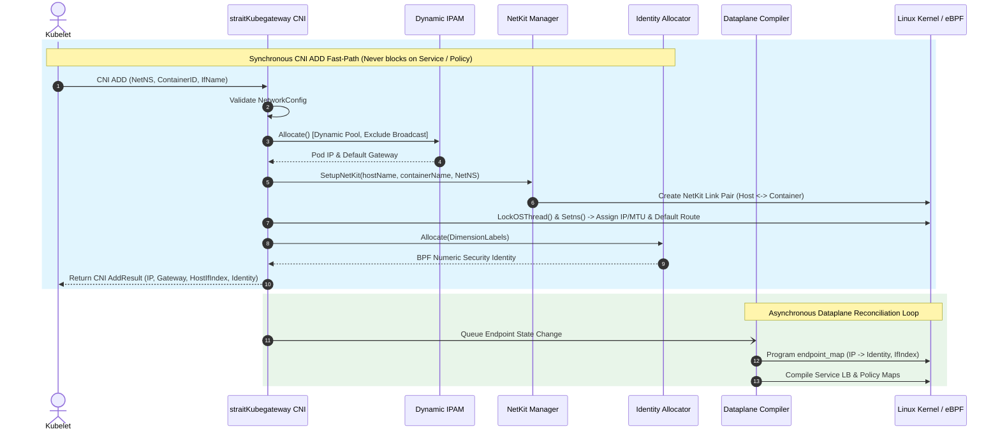
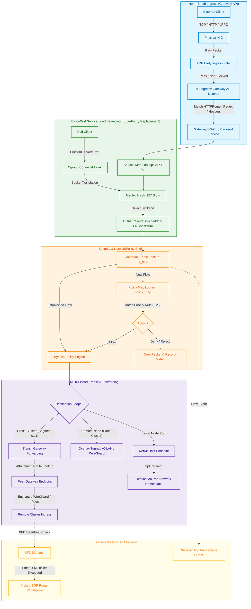

# Workflow & Traffic Lifecycles

This document details the primary lifecycle and packet-forwarding workflows of **StraitKubeGateway**, complete with color-coded Mermaid diagrams and lifecycle step breakdowns.

---

## 1. CNI Pod Creation Workflow (CNI ADD)

The CNI ADD execution is divided into a **synchronous fast path** (must return within milliseconds) and **asynchronous dataplane reconciliation** (runs without blocking pod initialization).

---

## 2. Comprehensive Traffic Flow & Transit Workflow

The following flowchart illustrates end-to-end packet processing across North-South Gateway ingress, East-West service load balancing, stateful policy evaluation, and Multi-Cluster Transit Gateway routing:

---

## 3. Color Code Legend & Architecture Key

| Color Code | Subsystem Domain | Description & Responsibilities |
|---|---|---|
| 🔵 **Blue (`#e1f5fe`)** | **North-South & Ingress Control** | Gateway API v1.6.1 reconciliation, listener binding, HTTPRoute matching (PathPrefix, Exact, Regex), and initial packet ingress handling via XDP and TC hooks. |
| 🟢 **Green (`#e8f5e9`)** | **Fast-Path & Service LB** | High-performance packet forwarding, NetKit device attachments, socket-level `connect4` acceleration, and Maglev consistent hashing (127-slot lookup) with L3/L4 checksum recalculation. |
| 🟠 **Orange (`#fff3e0`)** | **Stateful Security & Policy** | BPF identity resolution, stateful connection tracking (`ct_map`), priority-based `StraitNetworkPolicy` enforcement (0–255, lower=higher), deny-by-default ingress, and stateful flow bypass. |
| 🟣 **Purple (`#ede7f6`)** | **Multi-Cluster Transit & Encapsulation** | Cross-cluster inter-segment routing (Segment 0 backbone), Hub-and-Spoke and Mesh overlays, WireGuard Curve25519 (X25519) encryption, and NetKit namespace delivery. |
| 🟡 **Yellow (`#fffde7`)** | **Observability & BFD Fast Failover** | Canonical 11-attribute metadata telemetry propagation, Prometheus metrics emission, and RFC 5880 BFD sub-second link failure detection with dynamic BGP route withdrawal. |

---

## 4. Pod Teardown Workflow (CNI DEL)

When a pod is deleted by Kubernetes, CNI DEL executes synchronous resource reclamation:

1. **Flush NetNS Routes**: Removes all kernel default and host routing table entries in the pod namespace.
2. **Remove BPF Identity**: De-allocates the numeric security identity from `identity.Allocator`.
3. **Purge Policy State**: Cleans up endpoint entries in `endpoint_map` and associated conntrack sessions in `ct_map`.
4. **Release IP to IPAM**: Releases the IPv4/IPv6 address back into the dynamic `ipam.Pool`, making it immediately available for new allocations.
5. **Destroy NetKit Link Pair**: Removes the host NetKit interface (`netlink.LinkDel`), closing kernel device handles.
